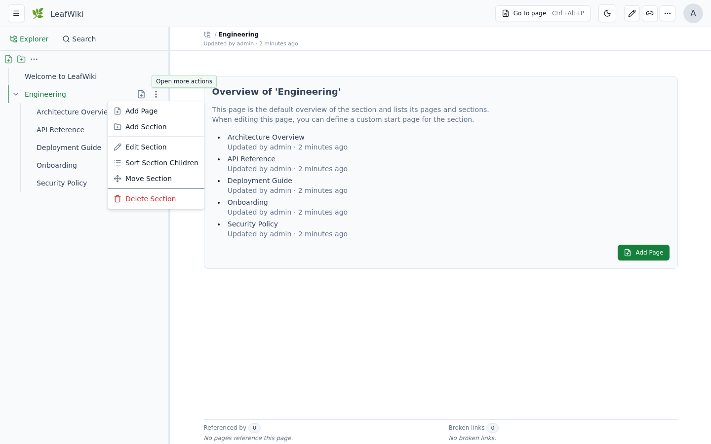
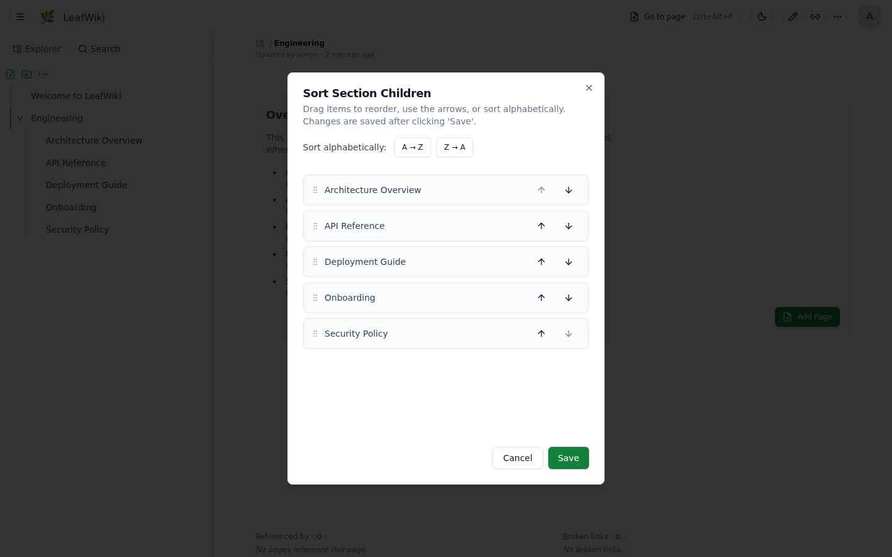

# 🌿 LeafWiki

[](https://github.com/perber/leafwiki/stargazers) [](https://github.com/perber/leafwiki/releases) [](https://github.com/perber/leafwiki/actions/workflows/backend.yml) [](https://github.com/perber/leafwiki/actions/workflows/frontend.yml)

Self-hosted wiki. Single Go binary. SQLite + Markdown stored on disk.

For engineers and self-hosters who want structured, long-lived documentation. No Node.js, no Redis, no Postgres — just a binary and a data directory.


If you've looked at Wiki.js or Outline and thought "this is too much to operate for what I need" — this could fit for you.

→ Try it without installing: **[demo.leafwiki.com](https://demo.leafwiki.com)** · `Ctrl+E` edit · `Ctrl+S` save · resets hourly  
→ If it fits, [a star](https://github.com/perber/leafwiki) helps others find it.

```bash
docker run -p 8080:8080 -v ~/leafwiki-data:/app/data \
  ghcr.io/perber/leafwiki:latest \
  --jwt-secret=yoursecret --admin-password=yourpassword --allow-insecure=true
```

→ [All install options](#install) (Docker Compose, Linux installer, binary)

---

## Table of Contents

- [Features](#features)
- [Good fit / not a fit](#good-fit--not-a-fit)
- [Install](#install)
  - [Docker](#docker)
  - [Docker Compose](#docker-compose)
  - [Linux installer](#linux-installer)
  - [Binary](#binary)
  - [Reset admin password](#reset-admin-password)
- [Operating Modes](#operating-modes)
- [Dev Setup](#dev-setup)
- [Configuration](#configuration)
  - [CLI Flags](#cli-flags)
  - [Environment Variables](#environment-variables)
  - [Custom Stylesheet](#custom-stylesheet)
  - [Reverse-Proxy Authentication](#reverse-proxy-authentication)
  - [Unix Socket](#unix-socket-v0113)
  - [Git Backup](#git-backup-v0113-experimental)
  - [Security](#security)
  - [Operations notes](#operations-notes)
- [Keyboard Shortcuts](#keyboard-shortcuts)
- [External Edits & Resync](#external-edits--resync)
- [Sorting Pages](#sorting-pages)
- [Support this project](#support-this-project)
- [Contributing](#contributing)

---

## Features

**Operations:**
- Single Go binary — no external database, no runtime dependencies
- Markdown on disk — page content is readable outside the app, backup is `cp -r` (stop the app first)
- Runs on Linux, macOS, Windows, Raspberry Pi (x86_64 and ARM64)
- Reverse-proxy friendly with `--base-path`
- Reverse-proxy authentication via trusted HTTP header (v0.10+)
- API keys for programmatic and agent access, admin-managed, read-only, experimental/opt-in
- Three access modes: fully internal, public read with login-only editing, or open editing without login (see [Operating Modes](#operating-modes))
- Roles: admin, editor, viewer

**Core functionality:**
- Tree navigation — explicit hierarchy, not flat note feeds
- Manual page ordering — sort order is explicit, not driven by filename (see [Sorting Pages](#sorting-pages))
- Full-text search across titles and content, with tag-based filtering
- Tags on pages — searchable and filterable across the wiki
- Backlinks and link status per page (incoming, outgoing, broken links)
- Built-in Markdown editor with live preview, keyboard shortcuts, and autocomplete for internal page links
- Optimistic locking for concurrent edits
- Markdown: tables, task lists, footnotes, callouts (`:::info` / `:::warning`), Mermaid diagrams, KaTeX math blocks (`$$...$$`, inline `$...$` not supported), sanitized inline HTML

**Customization:**
- Custom stylesheet (`--custom-stylesheet`, v0.8.5+)
- Inject HTML/JS into `<head>` for analytics or custom CSS
- Branding: logo, favicon, site name
- Dark mode and mobile-friendly UI

**Opt-in via feature flags:**
- Revision history (`--enable-revision`)
- Automatic link rewriting when pages are renamed or moved (`--enable-link-refactor`)
- Git backup — push wiki content to a remote Git repository via SSH (`--git-backup`, v0.11.3, experimental)

**Markdown import:**
- ZIP-based importer for editors and admins
- Supports Obsidian-style wiki link rewriting on import
- Best results with a reasonably clean folder structure; not a fully automatic converter for all source formats

**Mobile:**

<p align="center">
  
  
  
</p>

---

## Good fit / not a fit

**Good fit:**
- Personal wikis, engineering notebooks, and runbooks
- Internal team or homelab documentation
- Existing Markdown or Obsidian vaults that need a structured wiki UI
- Small teams that want tree navigation over flat note feeds
- Self-hosted environments with low operational overhead

**Probably not a fit:**
- Organizations needing complex enterprise permissions or approval workflows
- Real-time collaborative editing
- Teams looking for a Confluence or Notion replacement

LeafWiki is intentionally narrower than those systems. That focus is part of the value.

---

**Prefer not to run your own server?** Free hosted beta — 10 spots, starting September 2026. [Get a beta spot →](https://leafwiki.com/hosted/#waitlist) and help shape the hosted version.

---

## Install

### Docker

```bash
docker run -p 8080:8080 \
    -v ~/leafwiki-data:/app/data \
    ghcr.io/perber/leafwiki:latest \
    --jwt-secret=yoursecret \
    --admin-password=yourpassword \
    --allow-insecure=true
```

`--allow-insecure=true` is required for plain HTTP. Omit it when serving over HTTPS (make sure your reverse proxy forwards `X-Forwarded-Proto: https`).

**Non-root:**

```bash
docker run -p 8080:8080 \
    -u 1000:1000 \
    -v ~/leafwiki-data:/app/data \
    ghcr.io/perber/leafwiki:latest \
    --jwt-secret=yoursecret \
    --admin-password=yourpassword \
    --allow-insecure=true
```

The data directory must be writable by the specified user.

### Docker Compose

```yaml
services:
  leafwiki:
    image: ghcr.io/perber/leafwiki:latest
    container_name: leafwiki
    user: 1000:1000
    ports:
      - "8080:8080"
    environment:
      - LEAFWIKI_JWT_SECRET=yourSecret
      - LEAFWIKI_ADMIN_PASSWORD=yourPassword
      - LEAFWIKI_ALLOW_INSECURE=true  # Required for plain HTTP. Omit for HTTPS (ensure `X-Forwarded-Proto: https` is forwarded).
    volumes:
      - ${HOME}/leafwiki-data:/app/data
    restart: unless-stopped
```

### Linux installer

```bash
sudo /bin/bash -c "$(curl -fsSL https://raw.githubusercontent.com/perber/leafwiki/main/install.sh)"
```

Installs LeafWiki as a system service. Tested on Ubuntu, Debian, and Raspbian.

**Update:**

```bash
sudo /bin/bash -c "$(curl -fsSL https://raw.githubusercontent.com/perber/leafwiki/main/update.sh)"
```

> Only works if you installed with the script above. Not compatible with Docker or binary installs.

**Non-interactive mode:**

```bash
cp .env.example .env
# Edit .env with your configuration
sudo ./install.sh --non-interactive --env-file ./.env
```

> Security: in interactive mode, environment variables are written in plain text to `/etc/leafwiki/.env`. Restrict access to that file.

**Deployment examples:**
- [Install with nginx on Ubuntu](docs/install/nginx.md)
- [Install on a Raspberry Pi](docs/install/raspberry.md)

### Binary

```bash
chmod +x leafwiki
./leafwiki --jwt-secret=yoursecret --admin-password=yourpassword --allow-insecure=true
```

The server binds to `127.0.0.1:8080` by default. To expose it on the network:

```bash
./leafwiki --jwt-secret=yoursecret --admin-password=yourpassword --host=0.0.0.0 --allow-insecure=true
```

Default data directory is `./data`. Change with `--data-dir`.

### Reset admin password

```bash
./leafwiki reset-admin-password
```

---

## Operating Modes

LeafWiki supports three access modes. Pick the one that matches your environment:

### 1. Internal wiki — login required (default)

All access requires authentication. Nobody can read or edit without a valid account. This is the default behavior when no access flags are set.

```bash
./leafwiki --jwt-secret=yoursecret --admin-password=yourpassword
```

Use this for team-internal wikis or homelab setups where content should stay private.

### 2. Public read, login required for editing

Anyone can browse the wiki without logging in. Only authenticated users with an editor or admin role can make changes.

```bash
./leafwiki --jwt-secret=yoursecret --admin-password=yourpassword --public-access=true
```

Use this for open documentation or project wikis where readers don't need accounts, but you still want to control who can edit.

### 3. No login — everyone can read and edit (`--disable-auth`)

Authentication is completely disabled. Anyone who can reach the server can read and edit all pages.

```bash
./leafwiki --disable-auth --host=127.0.0.1
```

> ⚠️ Only use this on trusted internal networks or local setups. Never expose a `--disable-auth` instance to the public internet.

---

## Dev Setup

**Stack:** Go · React (Vite) · SQLite

```bash
git clone https://github.com/perber/leafwiki.git
cd leafwiki
```

**Terminal 1 — Frontend:**
```bash
cd ui/leafwiki-ui
npm install
npm run dev
```

**Terminal 2 — Backend:**
```bash
cd cmd/leafwiki
go run . --jwt-secret=yoursecret --allow-insecure=true --admin-password=yourpassword
```

Vite starts on `http://localhost:5173`. The backend binds to `127.0.0.1` by default.

See [CONTRIBUTING.md](CONTRIBUTING.md) for contribution guidelines.

---

## Configuration

### Required

| Flag | Description |
|------|-------------|
| `--jwt-secret` | Secret for signing JWTs. Keep it secure. |
| `--admin-password` | Initial admin password (only applied if no admin exists yet). |

### Optional admin identity

| Flag | Description | Default |
|------|-------------|---------|
| `--admin-username` | Initial admin username (only applied if no admin exists yet). | `admin` |
| `--admin-email` | Initial admin email (only applied if no admin exists yet). | `admin@localhost` |

For plain HTTP: add `--allow-insecure=true` so login and CSRF cookies work.

### CLI Flags

| Flag                             | Description                                                             | Default       | Since   |
|----------------------------------|-------------------------------------------------------------------------|---------------|---------|
| `--host`                         | Host/IP the server binds to                                             | `127.0.0.1`   | –       |
| `--port`                         | Port the server listens on                                              | `8080`        | –       |
| `--unix-socket`                  | Unix domain socket path; overrides `--host` and `--port`                | `""`          | v0.11.3 |
| `--data-dir`                     | Directory where data is stored                                          | `./data`      | –       |
| `--admin-username`               | Initial admin username (only applied if no admin exists yet)            | `admin`       | v0.12.0 |
| `--admin-email`                  | Initial admin email (only applied if no admin exists yet)               | `admin@localhost` | v0.12.0 |
| `--public-access`                | Allow public read-only access                                           | `false`       | –       |
| `--base-path`                    | URL prefix for reverse proxy setups (e.g. `/wiki`)                      | `""`          | v0.8.2  |
| `--allow-insecure`               | ⚠️ Enables HTTP for auth cookies (required for plain HTTP)              | `false`       | v0.7.0  |
| `--disable-auth`                 | ⚠️ Disable all authentication (internal networks only)                  | `false`       | v0.7.0  |
| `--access-token-timeout`         | Access token duration (e.g. `24h`, `15m`)                               | `15m`         | v0.7.0  |
| `--refresh-token-timeout`        | Refresh token duration (e.g. `168h`)                                    | `168h`        | v0.7.0  |
| `--max-asset-upload-size`        | Max upload size (e.g. `50MiB`, `52428800`)                              | `50MiB`       | v0.8.5  |
| `--custom-stylesheet`            | Path to a `.css` file inside the data dir                               | `""`          | v0.8.5  |
| `--inject-code-in-header`        | Raw HTML/JS injected into `<head>`                                      | `""`          | v0.6.0  |
| `--hide-link-metadata-section`   | Hide backlinks and link status panel                                    | `false`       | –       |
| `--enable-revision`              | Enable revision history                                                 | `false`       | v0.9.0  |
| `--enable-link-refactor`         | Enable link rewriting on rename/move                                    | `false`       | v0.9.0  |
| `--max-revision-history`         | Max revisions per page; `0` = unlimited                                 | `100`         | v0.9.0  |
| `--enable-http-remote-user`      | Enable reverse-proxy auth via HTTP header                               | `false`       | v0.10.0 |
| `--http-remote-user-header-name` | Header name carrying the username from the proxy                        | `Remote-User` | v0.10.0 |
| `--trusted-proxy-ips`            | Trusted proxy IPs/CIDRs for remote-user header                          | `""`          | v0.10.0 |
| `--login-url`                    | Redirect to an external URL instead of the built-in login form          | `""`          | v0.12.0 |
| `--logout-url`                   | Redirect to an external URL after logout                                | `""`          | v0.12.0 |
| `--http-remote-user-logout-url`  | ⚠️ Deprecated, use `--logout-url` instead                               | `""`          | v0.10.0 |
| `--disable-request-log`          | Suppress per-request HTTP access log lines                              | `false`       | v0.10.1 |
| `--git-backup`                   | ⚗️ Enable git backup to a remote repository                             | `false`       | v0.11.3 |
| `--git-backup-remote`            | ⚗️ SSH remote URL for git backup (e.g. `git@github.com:user/repo.git`) | `""`          | v0.11.3 |
| `--git-backup-branch`            | ⚗️ Branch to push to                                                    | `main`        | v0.11.3 |
| `--git-backup-ssh-key`           | ⚗️ Raw SSH private key (prefer env var)                                 | `""`          | v0.11.3 |
| `--git-backup-ssh-key-path`      | ⚗️ Path to SSH private key file                                         | `""`          | v0.11.3 |
| `--git-backup-ssh-known-hosts`   | ⚗️ Path to `known_hosts` for MITM protection                            | `""`          | v0.11.3 |
| `--git-backup-author-name`       | ⚗️ Git commit author name                                               | `LeafWiki Backup` | v0.11.3 |
| `--git-backup-author-email`      | ⚗️ Git commit author email                                              | `backup@leafwiki.local` | v0.11.3 |
| `--git-backup-interval`          | ⚗️ Backup interval (e.g. `60m`, `2h`); `0` = manual-only               | `60m`         | v0.11.3 |

> Docker image default: `LEAFWIKI_HOST` is set to `0.0.0.0` automatically by the container entrypoint if neither `--host` nor `LEAFWIKI_HOST` is provided.

### Environment Variables

| Variable                                | Description                                          | Default       | Since   |
|-----------------------------------------|------------------------------------------------------|---------------|---------|
| `LEAFWIKI_HOST`                         | Host/IP address                                      | `127.0.0.1`   | –       |
| `LEAFWIKI_PORT`                         | Port                                                 | `8080`        | –       |
| `LEAFWIKI_UNIX_SOCKET`                  | Unix domain socket path; overrides host/port         | `""`          | v0.11.3 |
| `LEAFWIKI_DATA_DIR`                     | Data directory path                                  | `./data`      | –       |
| `LEAFWIKI_ADMIN_PASSWORD`               | Initial admin password *(required)*                  | –             | –       |
| `LEAFWIKI_ADMIN_USERNAME`               | Initial admin username (only applied if no admin exists yet) | `admin`       | v0.12.0 |
| `LEAFWIKI_ADMIN_EMAIL`                  | Initial admin email (only applied if no admin exists yet) | `admin@localhost` | v0.12.0 |
| `LEAFWIKI_JWT_SECRET`                   | JWT signing secret *(required)*                      | –             | –       |
| `LEAFWIKI_PUBLIC_ACCESS`                | Allow public read-only access                        | `false`       | –       |
| `LEAFWIKI_BASE_PATH`                    | URL prefix for reverse proxy                         | `""`          | v0.8.2  |
| `LEAFWIKI_ALLOW_INSECURE`               | ⚠️ HTTP auth cookies                                 | `false`       | v0.7.0  |
| `LEAFWIKI_DISABLE_AUTH`                 | ⚠️ Disable authentication                            | `false`       | v0.7.0  |
| `LEAFWIKI_ACCESS_TOKEN_TIMEOUT`         | Access token duration                                | `15m`         | v0.7.0  |
| `LEAFWIKI_REFRESH_TOKEN_TIMEOUT`        | Refresh token duration                               | `168h`        | v0.7.0  |
| `LEAFWIKI_MAX_ASSET_UPLOAD_SIZE`        | Max upload size                                      | `50MiB`       | v0.8.5  |
| `LEAFWIKI_CUSTOM_STYLESHEET`            | Path to `.css` file inside data dir                  | `""`          | v0.8.5  |
| `LEAFWIKI_INJECT_CODE_IN_HEADER`        | HTML/JS injected into `<head>`                       | `""`          | v0.6.0  |
| `LEAFWIKI_HIDE_LINK_METADATA_SECTION`   | Hide backlinks and link status panel                 | `false`       | –       |
| `LEAFWIKI_ENABLE_REVISION`              | Revision history                                     | `false`       | v0.9.0  |
| `LEAFWIKI_ENABLE_LINK_REFACTOR`         | Link rewriting on rename/move                        | `false`       | v0.9.0  |
| `LEAFWIKI_MAX_REVISION_HISTORY`         | Max revisions per page; `0` = unlimited              | `100`         | v0.9.0  |
| `LEAFWIKI_ENABLE_HTTP_REMOTE_USER`      | Reverse-proxy auth via header                        | `false`       | v0.10.0 |
| `LEAFWIKI_HTTP_REMOTE_USER_HEADER_NAME` | Username header from proxy                           | `Remote-User` | v0.10.0 |
| `LEAFWIKI_TRUSTED_PROXY_IPS`            | Trusted proxy IPs/CIDRs                              | `""`          | v0.10.0 |
| `LEAFWIKI_LOGIN_URL`                    | Redirect to an external URL instead of the login form | `""`          | v0.12.0 |
| `LEAFWIKI_LOGOUT_URL`                   | Redirect to an external URL after logout             | `""`          | v0.12.0 |
| `LEAFWIKI_HTTP_REMOTE_USER_LOGOUT_URL`  | ⚠️ Deprecated, use `LEAFWIKI_LOGOUT_URL` instead     | `""`          | v0.10.0 |
| `LEAFWIKI_DISABLE_REQUEST_LOG`          | Suppress per-request HTTP access log lines           | `false`       | v0.10.1 |
| `LEAFWIKI_GIT_BACKUP`                   | ⚗️ Enable git backup                                | `false`       | v0.11.3 |
| `LEAFWIKI_GIT_BACKUP_REMOTE`            | ⚗️ SSH remote URL                                   | `""`          | v0.11.3 |
| `LEAFWIKI_GIT_BACKUP_BRANCH`            | ⚗️ Branch to push to                                | `main`        | v0.11.3 |
| `LEAFWIKI_GIT_BACKUP_SSH_KEY`           | ⚗️ Raw SSH private key (preferred over path)        | `""`          | v0.11.3 |
| `LEAFWIKI_GIT_BACKUP_SSH_KEY_PATH`      | ⚗️ Path to SSH private key file                     | `""`          | v0.11.3 |
| `LEAFWIKI_GIT_BACKUP_SSH_KNOWN_HOSTS`   | ⚗️ Path to `known_hosts` file                       | `""`          | v0.11.3 |
| `LEAFWIKI_GIT_BACKUP_AUTHOR_NAME`       | ⚗️ Git commit author name                           | `LeafWiki Backup` | v0.11.3 |
| `LEAFWIKI_GIT_BACKUP_AUTHOR_EMAIL`      | ⚗️ Git commit author email                          | `backup@leafwiki.local` | v0.11.3 |
| `LEAFWIKI_GIT_BACKUP_INTERVAL`          | ⚗️ Backup interval (e.g. `60m`); `0` = manual-only | `60m`         | v0.11.3 |

### Custom Stylesheet

Place a `.css` file inside your data directory and pass its path:

```bash
./leafwiki \
  --data-dir=./data \
  --custom-stylesheet=custom.css \
  --jwt-secret=yoursecret \
  --admin-password=yourpassword
```

- File must exist at `./data/custom.css`
- Served as `/custom.css` (or `${base-path}/custom.css` with `--base-path`)
- The endpoint is publicly accessible

### Reverse-Proxy Authentication

Available since v0.10.0. Use when an upstream proxy authenticates users and forwards the username via HTTP header.

```bash
./leafwiki \
  --jwt-secret=yoursecret \
  --admin-password=yourpassword \
  --enable-http-remote-user=true \
  --http-remote-user-header-name=X-Forwarded-User \
  --trusted-proxy-ips=127.0.0.1,172.18.0.0/16 \
  --login-url=https://auth.example.com/login \
  --logout-url=https://auth.example.com/logout
```

- Only trusts the header from IPs listed in `--trusted-proxy-ips`
- If the forwarded username doesn't exist in LeafWiki, the request is rejected
- Do not enable without configuring `--trusted-proxy-ips`
- `--login-url` and `--logout-url` are independent, optional redirect targets — set either or both to send users to an external IdP instead of the built-in login form / to redirect after logout
- `--login-url` and `--logout-url` must start with `http://` or `https://`; the server refuses to start otherwise. `--user-management-url` has no such restriction — it's only used as a link, so relative paths work too
- ⚠️ `--login-url` takes effect regardless of `--enable-http-remote-user` and has no in-app bypass: once set, *every* unauthenticated visit (including `/login` itself) redirects to it immediately. Double-check the URL before setting it — a wrong or unreachable value locks all users, including admins, out of the built-in login form
- `--http-remote-user-logout-url` (v0.10.0) is deprecated; use `--logout-url` instead. It still works as a fallback when `--logout-url`/`LEAFWIKI_LOGOUT_URL` isn't set, but a deprecation warning is logged

### Unix Socket (v0.11.3)

Use `--unix-socket` when LeafWiki should listen on a local unix domain socket instead of TCP.

```bash
./leafwiki \
  --unix-socket=/run/leafwiki/leafwiki.sock \
  --data-dir=./data \
  --jwt-secret=yoursecret \
  --admin-password=yourpassword
```

- `--unix-socket` overrides `--host` and `--port`
- LeafWiki still serves normal HTTP; a reverse proxy such as Nginx or Caddy connects to the socket
- If a stale socket file exists from a previous run, LeafWiki removes it before listening
- New socket files are created with permissions `0660`
- On Windows, unix sockets are not supported and LeafWiki returns a startup error if this option is used

### Git Backup (v0.11.3, experimental)

> **Experimental** — This feature is new and may change in future releases. Test it thoroughly before relying on it for critical data.

Git Backup pushes wiki **content** to a remote Git repository via SSH on a configurable interval. It covers the `root/` (pages) and `assets/` directories. Database files (`.db`, `.db-wal`, etc.) and runtime files are excluded via `.gitignore`.

Backups run automatically on a configurable interval and can also be triggered manually from the **Git Content Backup** page.

**CLI flags (v0.11.3+):**

| Flag | Description | Default |
|------|-------------|---------|
| `--git-backup` | Enable git backup | `false` |
| `--git-backup-remote` | SSH remote URL (e.g. `git@github.com:user/repo.git`) | `""` |
| `--git-backup-branch` | Branch to push to | `main` |
| `--git-backup-ssh-key` | Raw SSH private key (prefer env var) | `""` |
| `--git-backup-ssh-key-path` | Path to SSH private key file | `""` |
| `--git-backup-ssh-known-hosts` | Path to `known_hosts` for MITM protection | `""` |
| `--git-backup-author-name` | Git commit author name | `LeafWiki Backup` |
| `--git-backup-author-email` | Git commit author email | `backup@leafwiki.local` |
| `--git-backup-interval` | Backup interval (e.g. `60m`, `2h`); `0` = manual-only | `60m` |

**Environment variables:**

| Variable | Description |
|----------|-------------|
| `LEAFWIKI_GIT_BACKUP` | Enable git backup |
| `LEAFWIKI_GIT_BACKUP_REMOTE` | SSH remote URL |
| `LEAFWIKI_GIT_BACKUP_BRANCH` | Branch to push to |
| `LEAFWIKI_GIT_BACKUP_SSH_KEY` | Raw SSH private key |
| `LEAFWIKI_GIT_BACKUP_SSH_KEY_PATH` | Path to SSH private key file |
| `LEAFWIKI_GIT_BACKUP_SSH_KNOWN_HOSTS` | Path to `known_hosts` file |
| `LEAFWIKI_GIT_BACKUP_AUTHOR_NAME` | Git commit author name |
| `LEAFWIKI_GIT_BACKUP_AUTHOR_EMAIL` | Git commit author email |
| `LEAFWIKI_GIT_BACKUP_INTERVAL` | Backup interval |

**Example (Docker Compose):**

```yaml
environment:
  - LEAFWIKI_GIT_BACKUP=true
  - LEAFWIKI_GIT_BACKUP_REMOTE=git@github.com:youruser/yourwiki-backup.git
  - LEAFWIKI_GIT_BACKUP_BRANCH=main
  - LEAFWIKI_GIT_BACKUP_SSH_KEY=${LEAFWIKI_GIT_BACKUP_SSH_KEY}  # from .env file
  - LEAFWIKI_GIT_BACKUP_INTERVAL=60m
```

**Notes:**

- `--git-backup-remote` is required when using SSH push. The remote must be an SSH URL (`git@...` or `ssh://...`).
- Either `--git-backup-ssh-key` or `--git-backup-ssh-key-path` is required when a remote is configured. Prefer the environment variable to avoid the key appearing in process listings.
- `--git-backup-ssh-known-hosts` is optional but recommended. If not set, LeafWiki falls back to `~/.ssh/known_hosts`. If that file does not exist either (common in containers), SSH host key verification is **disabled** — leaving connections open to MITM attacks. Set this flag explicitly in production.
- If the remote diverges (e.g. someone pushed directly to the backup branch), LeafWiki will stop auto-pushing and show a **Conflict — remote diverged** warning in the UI. Click **Force Push** in the UI to overwrite the remote with the current local backup history. Your wiki content is never lost — the local backup repo is always authoritative.
- This backs up **content only** — the SQLite database is not included. For a full backup, use your data directory (`cp -r` with the app stopped).

---

### Security

Enabled by default since v0.7.0:

- Secure, HttpOnly cookies for session handling
- CSRF protection on all state-changing requests
- Rate limiting on auth endpoints
- Role-based access: admin, editor, viewer

**`--disable-auth`** removes all authentication. Only use for local development, trusted internal networks, or isolated environments.

```bash
# Safe local-only example:
./leafwiki --disable-auth --host=127.0.0.1
```

For most setups, prefer `--public-access` for read-only public access and the viewer role for restricted accounts.

### Operations notes

- Default bind: `127.0.0.1` (binary) / `0.0.0.0` (Docker image)
- Default data dir: `./data` (binary) / `/app/data` (container)
- Defaults are intentionally conservative — a fresh install does not become network-exposed by accident

---

## Keyboard Shortcuts

| Action                | Shortcut                               |
|-----------------------|----------------------------------------|
| Edit mode             | `Ctrl + E` / `Cmd + E`                 |
| Save                  | `Ctrl + S` / `Cmd + S`                 |
| Search                | `Ctrl + Shift + F` / `Cmd + Shift + F` |
| Navigation pane       | `Ctrl + Shift + E` / `Cmd + Shift + E` |
| Go to page            | `Ctrl + Alt + P` / `Cmd + Option + P`  |
| Bold                  | `Ctrl + B` / `Cmd + B`                 |
| Italic                | `Ctrl + I` / `Cmd + I`                 |
| Headline 1–3          | `Ctrl + Alt + 1–3` / `Cmd + Alt + 1–3` |

`Ctrl+V` / `Cmd+V` for pasting images and files works in the editor.  
`Esc` closes modals, dialogs, and edit mode.

---

## External Edits & Resync

If you edit Markdown files directly on disk — a text editor, Git, a script, a bulk import — LeafWiki won't pick up the changes on its own. Trigger a resync one of two ways:

- **Admin UI:** trigger it manually from the maintenance/admin settings page, with live progress across four phases (tree, links, tags, search).
- **OS signal:** send `SIGUSR1` or `SIGHUP` to the running process (e.g., from a git post-receive hook or a cron job) — no restart needed.

Both paths share the same resync job, so either way you get the same consistent result. This is separate from `.leafwikiignore` changes, which are only read at startup.

**New files without a `leafwiki_id`:** every page's identity lives in a `leafwiki_id` field in its own frontmatter, not in its filename or path — that's what lets pages survive renames and moves without losing their identity. If you add a `.md` file yourself (not created through the app) and it has no `leafwiki_id` yet, the next resync generates one and **writes it back into the file on disk**. This is automatic and requires no action from you, but it does mean the file changes on disk after the resync — worth knowing if you manage `root/` with your own separate Git workflow (outside LeafWiki's built-in [Git Backup](#git-backup-v0113-experimental)), since that ID write-back will show up as an extra diff you didn't make yourself.

---

## Sorting Pages

Page order in LeafWiki is **explicit and manual** — it does not follow filename or alphabetical order automatically. By default, pages appear in the order they were created.

LeafWiki is not a file browser. The tree reflects the structure you define, and the order you set is the order your readers see.

To reorder the pages inside a section or under a parent page:

1. Hover over the section or page in the sidebar tree to reveal the action buttons
2. Click the **⋮** (more actions) button
3. Select **Sort Section Children** or **Sort Page Children**



The sort dialog lets you drag items into position, use the ↑ ↓ arrow buttons, or jump to alphabetical order with **A → Z** / **Z → A**. Click **Save** to apply.



> Sorting is per level — the order of a section's direct children is independent of deeper nested items.

---

## Support this project

If it's useful to you:

- ⭐ **[Star the repo](https://github.com/perber/leafwiki)** — helps others find it
- 💛 **[Sponsor on GitHub](https://leafwiki.com/support)** — supports ongoing maintenance, bug fixes, and new features  
- 🚀 **[Don't want to self-host? Get a free beta spot](https://leafwiki.com/hosted/#waitlist)** — 10 spots, hosted beta starting September 2026, help shape the hosted version

Need help deploying LeafWiki for your team? [Business support & setup →](https://leafwiki.com/support/)

---

## Contributing

Contributions, discussions, and feedback are welcome.  
Open an issue or start a discussion on GitHub. Follow the repository to get notified about new releases.
