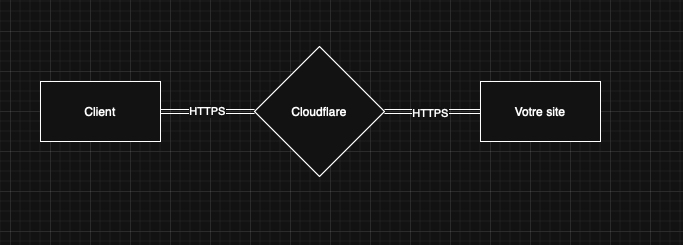
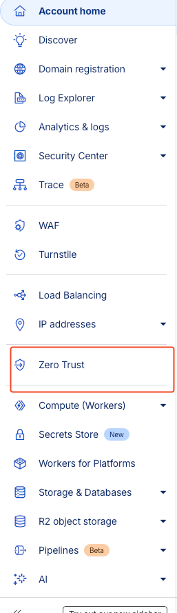
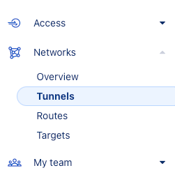
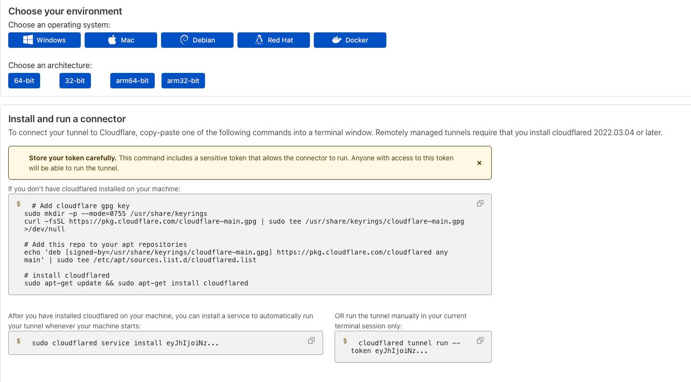
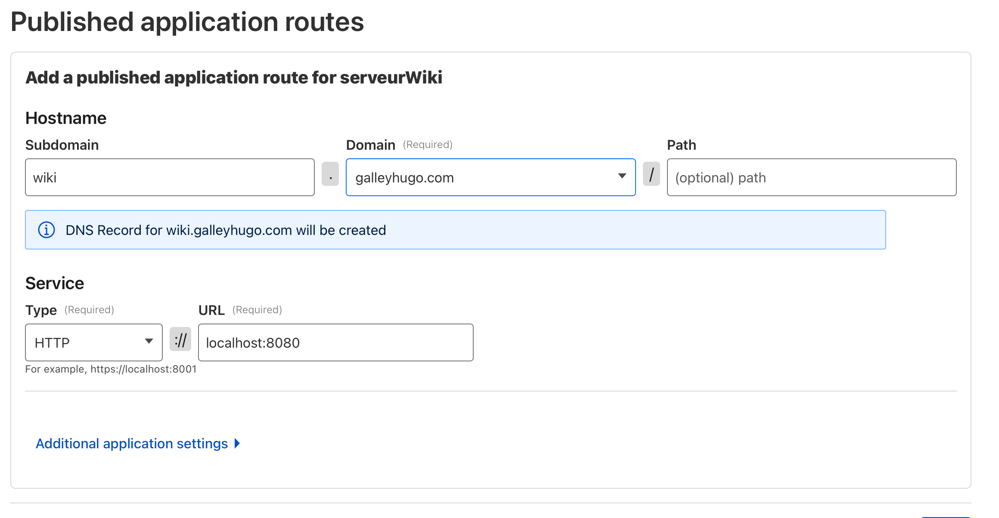

# Install `Leafwiki` on a Raspberry Pi

Short introduction: this file explains how to install Leafwiki on a Raspberry Pi and how to expose it to the Internet using Cloudflare Tunnel.

## Project installation
To begin, you need to install `Leafwiki`. Here is the "quick install" command:
```bash
curl -sL https://raw.githubusercontent.com/perber/leafwiki/main/install.sh -o install.sh && chmod +x ./install.sh && sudo ./install.sh --arch arm64
```

Thanks to this command, the Leafwiki service is now installed and should be accessible locally at:

http://localhost:8080/

## Cloudflare

Great — we have a server where we can run our site. However, for now all of this is only accessible on our local network. In other words, only people connected to our network can access it.

To expose the site to the Internet, we could open the ports on the router, but that introduces significant security risks.

We will therefore use **Cloudflare** and its Tunnel service.

## Explanation

This is a **Content Delivery Network (CDN)** service that sits between the user and our server.



Traffic first passes through **Cloudflare**, which then redirects it to our machine, allowing us to **hide our IP address**.

In our case, we will use a **tunnel**, which works a bit like a VPN: it redirects incoming requests via Cloudflare to the local server.

Our site will be exposed as a **subdomain** of your main domain, for example: `wiki.monsite.com`.


## Domain registration

To host your site, you will need a **domain name**. Whether the domain is purchased at Cloudflare or elsewhere does not matter: if your domain is at another provider, you will need to follow the process to transfer DNS management to Cloudflare.

Sign up on the [Cloudflare dashboard](https://dash.cloudflare.com/) if needed.

---

## Creating a tunnel

Once your domain is configured on the Cloudflare side, you can create a tunnel.

In the Cloudflare dashboard, go to **Zero Trust**, then **Network → Tunnels**.



Click **Create a tunnel**, then select **Cloudflared**. Give your tunnel a name; you will then arrive at the configuration creation page.



## Server configuration

Once the tunnel is created on Cloudflare, you must link it to your machine. Follow the instructions provided by Cloudflared in the dashboard:



Connect to your Raspberry Pi via SSH and copy/paste the commands shown.

---

## Exposing your application

Once the machine and the tunnel are connected, you must register the application to expose, here `Leafwiki`. Fill in the requested information and save the configuration.

Choose the `HTTP` protocol and enter `localhost:8080` to target Leafwiki.

