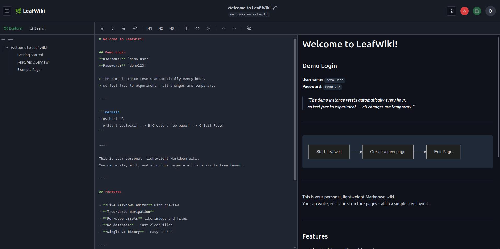

# 🌿 LeafWiki

**A lightweight, tree-based wiki for technical and operational documentation, designed to be self-hosted and evolving toward team-oriented use cases.**  


LeafWiki is designed for individuals and small teams who want a self-hosted wiki with full control over structure, content, and deployment, with a focus on technical and operational documentation.

---

## Preview



---

**Mobile View:**

<p align="center">
  
  
  
</p>

---

## Live Demo

A public demo of LeafWiki is available here:

🌐 **[demo.leafwiki.com](https://demo.leafwiki.com)**  

Login credentials are displayed on the demo site.  
The demo instance resets automatically every hour, so all changes are temporary.

---

## What LeafWiki is good for today

LeafWiki works well today for: 
- A personal knowledge base or wiki managed by one main maintainer
- Project or technical documentation with low concurrent editing
- Operational or engineering documentation maintained by a small team or a primary owner
- Structured notes that benefit from explicit hierarchy and ordering

---

## Why Another Wiki?

After using several existing wiki and documentation tools, the goal behind LeafWiki was to build something simpler and easier to operate.

Many existing solutions rely on heavy infrastructure or databases, even though the core content is usually just Markdown files.

In practice, writing documentation often comes with unnecessary friction. Authors are asked to configure too much upfront or to decide where assets belong before any content is written, which interrupts the writing flow.

LeafWiki was designed around a few simple questions:
- Why require a complex database for Markdown content?
- Why should self-hosting a wiki require significant setup effort?
- Why can’t structure and navigation be handled explicitly while keeping files portable?

The result is a lightweight wiki engine with:
- Plain Markdown files stored on disk
- Explicit tree-based structure
- A single binary with minimal dependencies
- A focus on simple self-hosting

LeafWiki intentionally prioritizes clarity and simplicity over feature completeness.

In operational and engineering contexts, documentation often needs to be reliable, easy to update, and simple to operate over long periods of time.
LeafWiki is designed to support these needs without introducing unnecessary operational complexity.


---

## Core principles

LeafWiki is built around a small set of clear principles:

- **Plain Markdown storage**  
  All content is stored as Markdown files on disk. This avoids vendor lock-in and keeps your data portable and transparent.

- **No external database required**  
  LeafWiki uses SQLite internally and does not require running or managing a separate database service.

- **Explicit structure management**  
  Page hierarchy and ordering are managed explicitly, allowing pages to be reordered without relying on the filesystem layout alone.

- **Self-hosted by design**
  LeafWiki is designed to run on a single server with minimal operational overhead.

---

### Data model

LeafWiki stores page content as Markdown files and uses a combination of JSON and SQLite for navigation, metadata, and search.
For details on the current model and its constraints, see [Known limitations](#known-limitations).

---

## What LeafWiki supports

- Built-in Markdown editor
- Tree-based navigation for structured content
- Public read-only access
- Support for diagrams via Mermaid
- Full-text search across page titles and content
- Image and asset support
- Dark mode and mobile-friendly UI
- Separation between admin and editor users

LeafWiki runs as a single Go binary, does not require an external database, and is designed to be self-hosted using Docker or as a standalone service.

LeafWiki supports public read-only access for documentation use cases,
while keeping editing and structure management restricted to authenticated users.

---

## What LeafWiki is not

LeafWiki is not intended to be a full-featured enterprise documentation platform.

It intentionally avoids complex workflows, real-time collaborative editing, and deeply configurable permission systems in order to stay simple, predictable, and easy to self-host.

---

## Project Status

LeafWiki provides a stable base for everyday use, but is not feature-complete yet.
Some foundational features, especially around long-term content safety and collaboration, are still evolving and under active development.
The current focus is on **refining existing functionality**, improving **stability**, and evolving the platform carefully toward a wiki for long-term use.

**Current priorities:**  
- Versioning
- Operations Metadata
- Optimistic Locking

The editor and admin features are in place, but collaboration is still basic and currently following a *last-write-wins* approach.
More advanced team features, such as versioning, are now active priorities and are being developed iteratively.

> **LeafWiki** is actively developed and open to collaboration 🌿 

For a detailed history of changes and releases, see the [CHANGELOG](CHANGELOG.md).

Longer term, LeafWiki aims to better support team-oriented workflows common in operations and engineering environments, while preserving its focus on simplicity and predictability.


---

## Installation

LeafWiki is distributed as a single Go binary and can be run directly on the host or via Docker.
The sections below show a recommended quick start and a few common installation examples.

### Quick start

The easiest way to install LeafWiki is using the provided installation script:

```bash
curl -sL https://raw.githubusercontent.com/perber/leafwiki/main/install.sh -o install.sh && chmod +x ./install.sh && sudo ./install.sh --arch amd64
```

This installs LeafWiki as a system service on the target machine.
The service is started automatically after installation.
> The installation script has been tested on Ubuntu.
> Feedback for other distributions is welcome via GitHub issues.

#### Deployment examples 
- [Install LeafWiki with nginx on Ubuntu](docs/install/nginx.md)
- [Install LeafWiki on a Raspberry Pi](docs/install/raspberry.md)


#### Security notes

Sensitive information such as the JWT secret and administrator password appears in plain text in the systemd service file `/etc/systemd/system/leafwiki.service`.
Make sure that this file is accessible only to authorized users.

#### Installer script options

The installation script supports a small set of flags that control how LeafWiki is installed on the target system.
These options are only used during installation and do not affect the runtime behavior of LeafWiki.

| Flag               | Description                                                 | Default       |
|--------------------|-------------------------------------------------------------|---------------|
| `--arch`           | Target architecture for the binary (e.g. `amd64`, `arm64`)  |       -       |
| `--host`           | Host/IP address the server binds to                         | `0.0.0.0`     |
| `--port`           | Port the server listens on                                  | `8080`        |


### Docker

You can run LeafWiki as a container using Docker.

```bash
docker run -p 8080:8080 \
    -v ~/leafwiki-data:/app/data \
    ghcr.io/perber/leafwiki:latest \
    --jwt-secret=yoursecret \
    --admin-password=yourpassword
```

By default, the container runs as root and stores data in `/app/data`.

---

**Running as non-root user**
To avoid running the container as root, specify a user ID:

```bash
docker run -p 8080:8080 \
    -u 1000:1000 \
    -v ~/leafwiki-data:/app/data \
    ghcr.io/perber/leafwiki:latest \
    --jwt-secret=yoursecret \
    --admin-password=yourpassword
```

Make sure that the mounted data directory is writable by the specified user.

The data directory inside the container will be `/app/data`..

---

### Manual installation

Download the latest release binary from GitHub, make it executable, and start the server:

```
chmod +x leafwiki
./leafwiki --jwt-secret=yoursecret
```

Default port is `8080`, and the default data directory is `./data`.
You can change the data directory with the `--data-dir` flag.

The JWT secret is required for authentication and should be kept secure.


## Authentication and admin user

### Default admin user

For security reasons, it is strongly recommended to change the default admin password after the first login.

On first startup, LeafWiki creates an admin user with the default password `admin`.

The password can be changed later via the admin settings or during startup using the CLI:

```bash
./leafwiki --admin-password=newpassword --jwt-secret=yoursecret
```

> Note: `--admin-password` (or the `LEAFWIKI_ADMIN_PASSWORD` env var) is only used on first startup, when no admin user exists yet.


### Reset Admin Password
If you need to reset the admin password, you can do so by running:

```bash
./leafwiki reset-admin-password
```

## Runtime Configuration

LeafWiki can be configured using command-line flags or environment variables.
These options control how the server runs after installation.

### CLI Flags

| Flag               | Description                                                 | Default       |
|--------------------|-------------------------------------------------------------|---------------|
| `--jwt-secret`     | Secret used for signing JWTs (required)                     | –             |
| `--host`           | Host/IP address the server binds to                         | `0.0.0.0`     |
| `--port`           | Port the server listens on                                  | `8080`        |
| `--data-dir`       | Directory where data is stored                              | `./data`      |
| `--admin-password` | Initial admin password (used only if no admin exists)       | `admin`       |
| `--public-access`  | Allow public read-only access                               | `false`       |
   

### Environment Variables

The same configuration options can also be provided via environment variables.
This is especially useful in containerized or production environments.

| Variable                 | Description                                                  | Default    |
|--------------------------|--------------------------------------------------------------|------------|
| `LEAFWIKI_HOST`          | Host/IP address the server binds to                          | `0.0.0.0`  |
| `LEAFWIKI_PORT`          | Port the server listens on                                   | `8080`     |
| `LEAFWIKI_DATA_DIR`      | Path to the data storage directory                           | `./data`   |
| `LEAFWIKI_ADMIN_PASSWORD`| Initial admin password *(used only if no admin exists yet)*  | `admin`    |
| `LEAFWIKI_JWT_SECRET`    | Secret used to sign JWT tokens *(required)*                  | –          |
| `LEAFWIKI_PUBLIC_ACCESS` | Allow public read-only access                                | `false`    |

These environment variables override the default values and are especially useful in containerized or production environments.

## Reverse proxy setup

When running LeafWiki behind a reverse proxy (nginx, Caddy, Traefik), it is recommended to bind the server to the loopback interface only.

```bash
# bind to localhost only
LEAFWIKI_HOST=127.0.0.1 ./leafwiki --jwt-secret=yoursecret

# or with the CLI flag
./leafwiki --host 127.0.0.1 --jwt-secret=yoursecret
```

When bound to `127.0.0.1`, the server is only accessible locally,
while the reverse proxy handles public traffic.


## Quick Start (Dev)

```
# 1. Clone the repo

git clone https://github.com/perber/leafwiki.git
cd leafwiki

# 2. Install frontend dependencies

cd ui/leafwiki-ui
npm install
npm run dev   # Starts Vite dev server on http://localhost:5173

# 3. In another terminal, start the backend

cd ../../cmd/leafwiki
go run main.go
```

---

## Known limitations

LeafWiki intentionally focuses on simplicity and a well-defined scope.
As a result, there are some important limitations to be aware of:

- **No page history or versioning**  
  Page edits overwrite previous content. Regular backups of the data directory are strongly recommended.

- **Basic concurrent editing model**  
  When multiple users edit the same page at the same time, the last saved version wins.
  LeafWiki is best suited for single maintainers or low-concurrency use.

- **Metadata stored outside Markdown files**  
  While page content is stored as Markdown files on disk, navigation structure is stored as JSON, and user data, metadata, and search indexes are stored in SQLite.

- **Limited permission model**  
  LeafWiki does not provide fine-grained permissions or complex role-based access control.

- **Security defaults require attention**  
  Initial setup uses simple defaults intended for local or first-time use.
  Admin credentials and secrets should be reviewed and secured before exposing LeafWiki publicly.

---

### Available Builds

LeafWiki is available as a native binary for the following platforms:

- **Linux (x86_64 and ARM64)**
- **macOS (x86_64 and ARM64)**
- **Windows (x86_64)**
- **Raspberry Pi (tested with 64-bit OS)**

---

## Contributing

Contributions, discussions, and feedback are very welcome.  
If you have ideas, questions, or run into issues, feel free to open an issue or start a discussion.

## Stay in the loop

Follow the repository to get updates about new releases and ongoing development.

