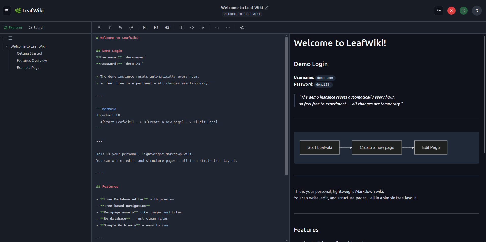
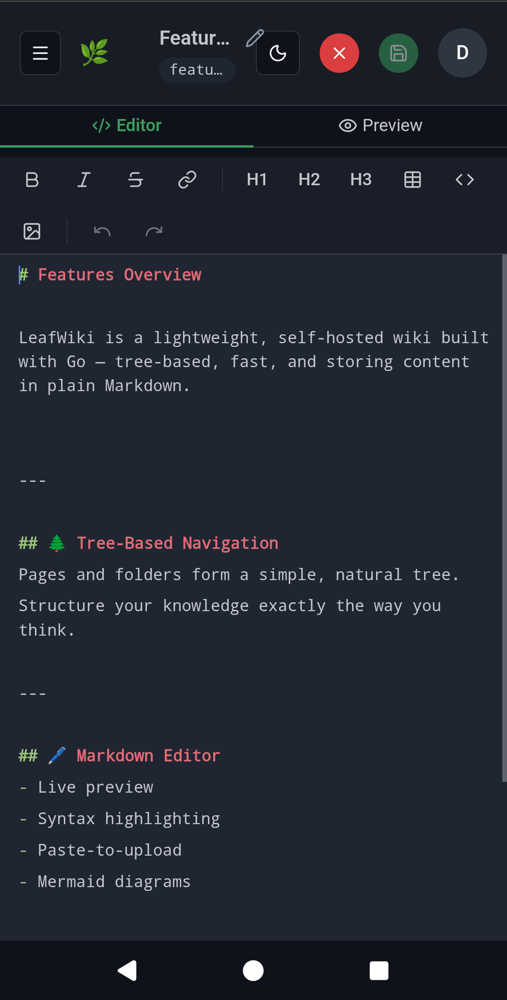
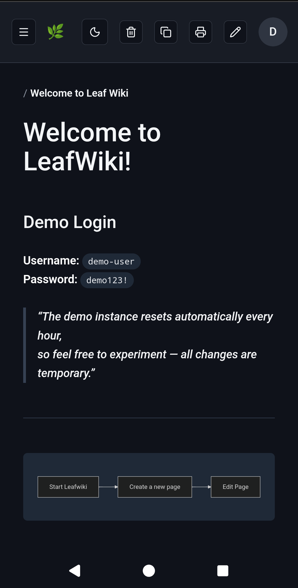
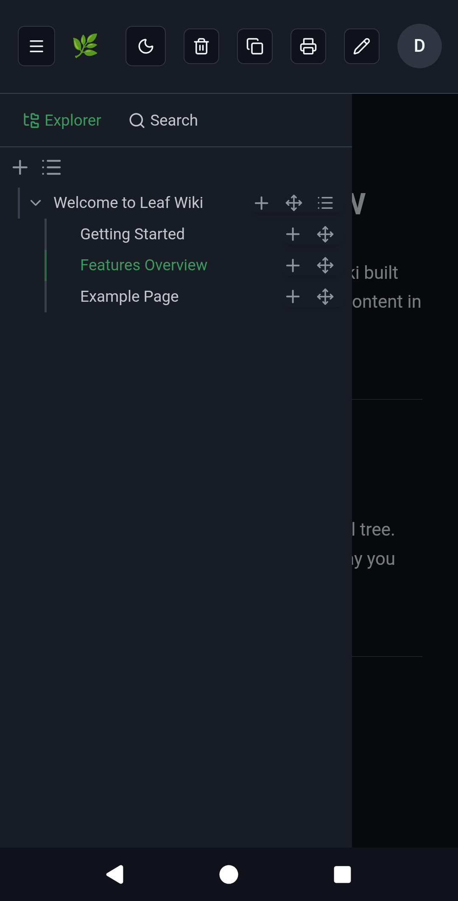

# 🌿 LeafWiki

**LeafWiki is the self-hosted documentation app for people who think in folders, not feeds.**  
Fast editing. Explicit tree navigation. Markdown stored on disk. Single Go binary.

LeafWiki is a lightweight wiki for runbooks, internal docs, and technical notes. It combines fast writing, structured navigation, and search in a focused app, while keeping your content portable as plain Markdown files on disk.

If you want something lighter than a large wiki platform, but more structured than scattered notes, LeafWiki sits in that gap.

---

## Live Demo

A public demo of LeafWiki is available here:

🌐 **[demo.leafwiki.com](https://demo.leafwiki.com)**  

Try: `Ctrl+E` to edit, `Ctrl+S` to save, `Ctrl+Shift+F` to open the search.  

Login credentials are displayed on the demo site.  
The demo instance resets automatically every hour, so all changes are temporary.

---

## Preview



---

**Mobile View:**

Mobile-friendly UI for reading (and editing) docs & runbooks on the go.

<p align="center">
  
  
  
</p>

---

## What LeafWiki is good for today

LeafWiki focuses on personal and small-team documentation use cases today.
It is designed for teams that want a focused documentation app with clear structure, fast editing, and full control over their data without taking on the weight of a larger platform.

LeafWiki is currently well-suited for:
- Personal technical notes and documentation
- Project documentation maintained by one main contributor
- Runbooks, operational knowledge and engineering guides for small teams
- Structured content that benefits from explicit hierarchy and ordering

---

## Project Status

LeafWiki is stable for everyday use as a personal or primary-owner wiki.  
The core features — writing, navigation, and search — are actively maintained and production-ready.

Collaboration is currently limited and follows a *last-write-wins* approach.  
More advanced team-oriented capabilities are under development, with a focus on durability and predictable behavior.


**Current priorities:**  
- Versioning
- Importing existing Markdown content
- Conflict handling for concurrent edits (optimistic locking)

Priorities are shaped by real-world usage, and development is iterative.
The platform will evolve cautiously toward team workflows while maintaining its principles of simplicity and low operational overhead.

> **LeafWiki** is actively developed and open to collaboration 🌿 

See the [CHANGELOG](CHANGELOG.md) for release details.

---

## Why Another Wiki?

Most wiki tools become projects of their own: databases to manage, plugins to maintain, workflows to configure, and too many setup decisions for a system that should just help you write, navigate, and find information.

LeafWiki takes a narrower view:
- Provide a focused documentation app instead of a sprawling platform
- Make structure explicit instead of inferred
- Keep content portable as plain Markdown on disk
- Stay easy to self-host and easy to understand
- Avoid turning documentation into platform maintenance

In practice, that means:
- A dedicated app for writing, reading, and organizing docs
- Explicit tree structure
- Markdown stored on disk
- Single-binary or container deployment
- Minimal operational overhead

---

## Core principles

LeafWiki is built around a small set of clear principles:

- **App-first, file-backed**  
  LeafWiki is built as a documentation app with its own navigation, editing, and search experience while keeping content stored as plain Markdown files on disk.

- **No external database required**  
  LeafWiki uses SQLite internally and does not require running or managing a separate database service.

- **Explicit structure management**  
  Structure is derived from the filesystem layout and persisted metadata files while page content stays plain Markdown.

- **Self-hosted by design**
  Designed to run on a single server with minimal operational overhead.

---

### Data model

LeafWiki stores page content as Markdown files on disk.
Navigation is reconstructed from the filesystem layout, child ordering is stored in `.order.json`, and search uses SQLite.
For details on the current model and its constraints, see [Known limitations](#known-limitations).

---

## What LeafWiki supports

- **Fast writing flow with editor shortcuts**
- **Explicit tree navigation instead of flat note lists**
- **Public read-only docs with authenticated editing**
- Built-in Markdown editor with live preview
- Full-text search across page titles and content
- Image and asset support
- Support for diagrams via Mermaid
- Brand customization such as logo, favicon, and site name
- Separation between admin, editor, and viewer users
- Dark mode and mobile-friendly UI
- Keyboard shortcuts for common actions such as save and search


## What LeafWiki is not

- Not a Confluence replacement
- Not real-time collaborative editing
- Not a workflow, approval, or document-control platform

LeafWiki is designed to stay focused, predictable, and easy to operate.

---

## Installation

LeafWiki is distributed as a single Go binary and can be run directly on the host or via Docker.
The sections below show a recommended quick start and a few common installation examples.

### Quick start

The easiest way to install LeafWiki is using the provided installation script:

```bash
sudo /bin/bash -c "$(curl -fsSL https://raw.githubusercontent.com/perber/leafwiki/main/install.sh)"
```

This installs LeafWiki as a system service on the target machine.
The service is started automatically after installation.
> The installation script has been tested on Ubuntu.
> Feedback for other distributions is welcome via GitHub issues.

#### Deployment examples 
- [Install LeafWiki with nginx on Ubuntu](docs/install/nginx.md)
- [Install LeafWiki on a Raspberry Pi](docs/install/raspberry.md)


#### Security notes
In interactive mode, environment variables appear in plain text in file `/etc/leafwiki/.env`.
Make sure that this file is accessible only to authorized users.

#### Installer script options

**Non-interactive mode**

The script supports non-interactive mode for automated deployments. Use the `--non-interactive` flag and provide configuration via an `.env` file.

An `.env.example` file is included showing all available environment variables. Copy and customize it as needed:

```bash
cp .env.example .env
# Edit .env with your configuration
sudo ./install.sh --non-interactive --env-file ./.env
```

### Docker

You can run LeafWiki as a container using Docker.

```bash
docker run -p 8080:8080 \
    -v ~/leafwiki-data:/app/data \
    ghcr.io/perber/leafwiki:latest \
    --jwt-secret=yoursecret \
    --admin-password=yourpassword
```

By default, the container binds to `0.0.0.0` so the wiki is reachable from your network.
The data directory inside the container is `/app/data`.

---

**Running as non-root user**
To avoid running the container as root, specify a user ID:

```bash
docker run -p 8080:8080 \
    -u 1000:1000 \
    -v ~/leafwiki-data:/app/data \
    ghcr.io/perber/leafwiki:latest \
    --jwt-secret=yoursecret \
    --admin-password=yourpassword
```

Make sure that the mounted data directory is writable by the specified user.

The data directory inside the container will be `/app/data`..

---

### Docker Compose

You can also run LeafWiki using Docker Compose:

```yaml
services:
  leafwiki:
    image: ghcr.io/perber/leafwiki:latest
    container_name: leafwiki
    user: 1000:1000  # Run as non-root (specify your {UID}:{GID})
    ports:
      - "8080:8080"
    environment:
      - LEAFWIKI_JWT_SECRET=yourSecret
      - LEAFWIKI_ADMIN_PASSWORD=yourPassword
      - LEAFWIKI_ALLOW_INSECURE=true  # WARNING: Enables HTTP by disabling Secure/HttpOnly cookies; for HTTPS deployments, omit this variable. HTTPS is the preferred method.
    volumes: 
      - ~/leafwiki-data:/app/data
    restart: unless-stopped
```

Make sure the mounted data directory (`~/leafwiki-data`) is writable by the user specified in the `user` field.

### Manual installation

Download the latest release binary from GitHub, make it executable, and start the server:

```
chmod +x leafwiki
./leafwiki --jwt-secret=yoursecret --admin-password=yourpassword
```

**Note:** By default, the server listens on `127.0.0.1`, which means it will only be accessible from localhost. If you want to access the server from other machines on your network, add `--host=0.0.0.0` to the command:

```
./leafwiki --jwt-secret=yoursecret --admin-password=yourpassword --host=0.0.0.0
```

Default port is `8080`, and the default data directory is `./data`.
You can change the data directory with the `--data-dir` flag.

The JWT secret is required for authentication and should be kept secure.


## Authentication and admin user

### Reset Admin Password
If you need to reset the admin password, you can do so by running:

```bash
./leafwiki reset-admin-password
```

## Runtime Configuration

LeafWiki can be configured using command-line flags or environment variables.
These options control how the server runs after installation.

### CLI Flags

| Flag                            | Description                                                            | Default       | Available since   |
|---------------------------------|------------------------------------------------------------------------|---------------|-------------------|
| `--jwt-secret`                  | Secret used for signing JWTs (required)                                | –             | –                 |
| `--host`                        | Host/IP address the server binds to                                    | `127.0.0.1`   | –                 |
| `--port`                        | Port the server listens on                                             | `8080`        | –                 |
| `--data-dir`                    | Directory where data is stored                                         | `./data`      | –                 |
| `--admin-password`              | Initial admin password *(used only if no admin exists)* (required)     | –             | –                 |
| `--public-access`               | Allow public read-only access                                          | `false`       | –                 |
| `--hide-link-metadata-section`  | Hide link metadata section                                             | `false`       | –                 |
| `--inject-code-in-header`       | Raw HTML/JS code injected into <head> tag (e.g., analytics, custom CSS)| `""`          | v0.6.0            |
| `--allow-insecure`              | ⚠️ Allows insecure HTTP usage for auth cookies (required for plain HTTP) | `false`       | v0.7.0            |
| `--access-token-timeout`        | Access token timeout duration (e.g. 24h, 15m)                          | `15m`         | v0.7.0            |
| `--refresh-token-timeout`       | Refresh token timeout duration (e.g. 168h, 7d)                         | `7d`          | v0.7.0            |
| `--disable-auth`                | ⚠️ Disable authentication & authorization (internal networks only!)    | `false`       | v0.7.0            |
| `--base-path`                   | URL prefix when served behind a reverse proxy (e.g. /wiki)              | `""`        | v0.8.2            |
| `--max-asset-upload-size`       | Maximum size for asset uploads (e.g. `50MiB`, `50MB`, `52428800`)      | `50MiB`       | v0.8.5            |


> When using the official Docker image, `LEAFWIKI_HOST` defaults to `0.0.0.0` if neither a `--host` flag nor `LEAFWIKI_HOST` is provided, as the container entrypoint sets this automatically.

### Environment Variables

The same configuration options can also be provided via environment variables.
This is especially useful in containerized or production environments.

| Variable                               | Description                                                             | Default    | Available since |
|----------------------------------------|-------------------------------------------------------------------------|------------|-----------------|
| `LEAFWIKI_HOST`                        | Host/IP address the server binds to                                     | `127.0.0.1`| -               |
| `LEAFWIKI_PORT`                        | Port the server listens on                                              | `8080`     | -               |
| `LEAFWIKI_DATA_DIR`                    | Path to the data storage directory                                      | `./data`   | -               |
| `LEAFWIKI_ADMIN_PASSWORD`              | Initial admin password *(used only if no admin exists yet)* (required)  | –          | -               |
| `LEAFWIKI_JWT_SECRET`                  | Secret used to sign JWT tokens *(required)*                             | –          | -               |
| `LEAFWIKI_PUBLIC_ACCESS`               | Allow public read-only access                                           | `false`    | -               |
| `LEAFWIKI_HIDE_LINK_METADATA_SECTION`  | Hide link metadata section                                              | `false`    | -               |
| `LEAFWIKI_INJECT_CODE_IN_HEADER`       | Raw HTML/JS code injected into <head> tag (e.g., analytics, custom CSS) | `""`       | v0.6.0          |
| `LEAFWIKI_ALLOW_INSECURE`              | ⚠️ Allows insecure HTTP usage for auth cookies (required for plain HTTP) | `false`    | v0.7.0          |
| `LEAFWIKI_ACCESS_TOKEN_TIMEOUT`        | Access token timeout duration (e.g. 24h, 15m)                           | `15m`      | v0.7.0          |
| `LEAFWIKI_REFRESH_TOKEN_TIMEOUT`       | Refresh token timeout duration (e.g. 168h, 7d)                          | `7d`       | v0.7.0          |
| `LEAFWIKI_DISABLE_AUTH`                | ⚠️ Disable authentication & authorization (internal networks only!)     | `false`    | v0.7.0          |
| `LEAFWIKI_BASE_PATH`                   | URL prefix when served behind a reverse proxy (e.g. /wiki)              | `""`       | v0.8.2          |
| `LEAFWIKI_MAX_ASSET_UPLOAD_SIZE`       | Maximum size for asset uploads (e.g. `50MiB`, `50MB`, `52428800`)       | `50MiB`    | v0.8.5          |


These environment variables override the default values and are especially useful in containerized or production environments.

> When using the official Docker image, `LEAFWIKI_HOST` defaults to `0.0.0.0` if neither a `--host` flag nor `LEAFWIKI_HOST` is provided, as the container entrypoint sets this automatically.

### Security Overview - Since v0.7.0

LeafWiki includes several built-in security mechanisms enabled by default:

- **Secure, HttpOnly cookies** for session handling
- **Session-based authentication** backed by a local database
- **CSRF protection** for all state-changing requests
- **Rate limiting** on authentication-related endpoints
- **Role-based access** (admin, editor, viewer)

These features are **enabled by default** and provide safe defaults for most deployments.

⚠️ Disabling or weakening these protections (e.g. via `--disable-auth` or `--allow-insecure`)
should only be done in **trusted, internal environments**.

---

### ⚠️ Security Warning: `--disable-auth`

> **⚠️ WARNING – USE WITH EXTREME CAUTION**

The `--disable-auth` flag **completely disables authentication and authorization** in LeafWiki.

When enabled:
- **Anyone with network access can edit, delete and modify all content**
- **No login, no roles, no session checks are enforced**
- **All security mechanisms are bypassed**

**This flag MUST NOT be used on public or internet-facing deployments.**

**Intended use cases only:**
- Local development
- Internal networks
- Environments protected by VPN and/or firewall
- Fully isolated test systems

If you use this flag, **you are fully responsible for securing access at the network level**.

**Safe example (local development only):**

```bash
./leafwiki --disable-auth --host=127.0.0.1
```

**For most setups, prefer:**
- Authentication enabled (default)
- `--public-access` for read-only public access
- Viewer role for read-only access

---

## Import Feature 

LeafWiki includes a built-in Markdown Importer that allows you to import existing Markdown files and folders into the wiki structure.
The importer is available as admin in the UI and can be used to quickly bring existing documentation into LeafWiki.

At the moment the importer does not support all features of the wiki (e.g. metadata, backlinks, assets, ...) but it provides a fast way to get started with existing Markdown content.

Please open an issue if you have specific feature requests or feedback for the importer.

---

## Quick Start (Dev)

```
# 1. Clone the repo

git clone https://github.com/perber/leafwiki.git
cd leafwiki

# 2. Install frontend dependencies

cd ui/leafwiki-ui
npm install
npm run dev   # Starts Vite dev server on http://localhost:5173

# 3. In another terminal, start the backend

cd ../../cmd/leafwiki

go run main.go --jwt-secret=yoursecret --allow-insecure=true --admin-password=yourpassword

# Note: The backend binds to 127.0.0.1 by default for security.
# If you need to access it from a different machine or network interface
# (e.g., testing on mobile or from another device), use:
# go run main.go --host=0.0.0.0

```

---

### Keyboard Shortcuts

| Action                     | Shortcut                                   |
|----------------------------|--------------------------------------------|
| Switch to Edit Mode        | `Ctrl + E` (or `Cmd + E`)                  |
| Go to Page                | `Ctrl + Alt + P` (or `Cmd + Option + P`)   |
| Switch to Search Pane      | `Ctrl + Shift + F` (or `Cmd + Shift + F`)  |
| Switch to Navigation Pane  | `Ctrl + Shift + E` (or `Cmd + Shift + E`)  |
| Save Page                  | `Ctrl + S` (or `Cmd + S`)                  |
| Bold Text                  | `Ctrl + B` (or `Cmd + B`)                  |
| Italic Text                | `Ctrl + I` (or `Cmd + I`)                  |
| Headline 1                 | `Ctrl + Alt + 1` (or `Cmd + Alt + 1`)      |
| Headline 2                 | `Ctrl + Alt + 2` (or `Cmd + Alt + 2`)      |
| Headline 3                 | `Ctrl + Alt + 3` (or `Cmd + Alt + 3`)      |

`Ctrl+V` / `Cmd+V` for pasting images or files is also supported in the editor.
`Esc` can be used to exit modals, dialogs or the edit mode.

More shortcuts may be added in future releases.

---

## Known limitations

LeafWiki focuses on simplicity with a well-defined scope.  
As a result, the following limitations apply today:

- **No built-in page history or versioning**  
  Saving changes overwrites the previous state. Versioning is a planned feature.

- **Basic concurrency handling**  
  Edits follow a last-write-wins model. Best suited for single maintainers or low-concurrency use.

- **Metadata not fully embedded in Markdown**  
  Page content is plain Markdown, but ordering metadata, user accounts, and search indexes are stored outside the page body.

- **Minimal access control**  
  No role-based permissions or fine-grained restrictions at this time.

---

### Available Builds

LeafWiki is available as a native binary for the following platforms:

- **Linux (x86_64 and ARM64)**
- **macOS (x86_64 and ARM64)**
- **Windows (x86_64)**
- **Raspberry Pi (tested with 64-bit OS)**

---

## Contributing

Contributions, discussions, and feedback are very welcome.  
If you have ideas, questions, or run into issues, feel free to open an issue or start a discussion.

## Stay in the loop

Follow the repository to get updates about new releases and ongoing development.
