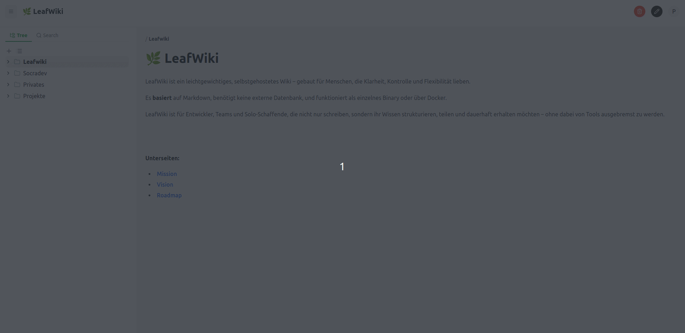

# 🌿 LeafWiki

**A lightweight, tree-based Markdown wiki – no database, just a single Go binary.**

LeafWiki is designed for teams and individuals who want a clean, fast, and self-hosted knowledge base — with full control over structure, content, and deployment.

---



---

## 📦 Status

> **Feature complete – evolving carefully** 
> LeafWiki has reached functional completeness for its original vision and is already powering real documentation workflows.  
> Development now focuses on steady refinement rather than rapid feature growth.
>
> The current focus is on: 
> - Stability and reliability 
> - Usability improvements
> - Testing and CI improvements 
> 
> In the long term, additional features like versioning, improved diagram support (e.g. Mermaid), … are planned —  
> but they’ll be introduced gradually, with stability taking priority.  
> 
> Want to try it and help shape it? You’re more than welcome.

LeafWiki now builds and runs natively on:
- **Linux (x86_64 and ARM64)**
- **Windows (x86_64)**
- **Raspberry Pi (tested with 64-bit OS)**

---

## 🧪 Live Demo

> **Test it yourself – no setup required!**  
> A public demo of LeafWiki is available here:

🌐 **[demo.leafwiki.com](https://demo.leafwiki.com)**  
**Username:** `demo-user`  
**Password:** `demo123!`  

> ⚙️ The demo instance resets automatically every hour,  
> so feel free to experiment — all changes are temporary.

---

## ✨ Features

- 🧾 Markdown-first with live editor + preview
- 🌲 True tree-structured pages (nested folders)
- 🔒 Role-based access (admin / editor)
- 🧠 no DB required
- 📂 Per-page assets with upload support
- 🖼️ Embed images and files with Markdown
- ⚙️ Single statically-linked Go binary (no dependencies)
- 🚀 Easily self-hosted (Docker or standalone)
- 🔁 Session auth with JWT tokens + refresh
- 🔍 Search functionality for page titles and content
- 📱 Mobile-friendly design
- 🌐 Public pages (viewable without login)
- 🖨️ Print view support

---

## 💭 Why Another Wiki?

After trying out tools like Wiki.js, Confluence, and DokuWiki, I wanted something simpler: no database, easy to host, Markdown-based, and truly Git-friendly.

- Why use a database just to store Markdown?
- Why should setup be a weekend project?
- Why can't a wiki just be file-based and fast?

**LeafWiki** was born out of that frustration — and the desire to have:

- 🧾 Clean Markdown files, organized in folders
- 🧠 A real tree structure, not a flat list
- ⚙️ A single binary with no external dependencies
- 🛠️ Something teams can actually self-host without DevOps pain

It’s not trying to be everything — just a solid, minimal wiki for people who want **clarity over complexity.**

---

## 💡 LeafWiki vs. Markdown Readers

LeafWiki is often compared to simple Markdown viewers or file browsers - but it’s built for a very different purpose.

|                 | Markdown Reader             | LeafWiki                                                         |
|-----------------|-----------------------------| -----------------------------------------------------------------|
| **Purpose**     | Read static `.md` files     | Create and manage a structured wiki                              |
| **Data source** | Reads directly from disk    | Uses Markdown files as storage, but manages structure internally |
| **Structure**   | Flat folder view            | True tree of folders and pages                                   |
| **Editing**     | External text editor        | Built-in Markdown editor with live preview                       |
| **Uploads**     | Not supported               | Per-page assets (images, files)                                  |
| **Search**      | File names only             | Indexed full-text search (titles + content)                      |
| **Hosting**     | Static / local              | Self-hosted Go web app                                           |
| **Access**      | No authentication           | Role-based access (admin / editor)                               |

> LeafWiki doesn’t just *read* Markdown files — it **organizes, edits, and serves** them.  
> It’s not a viewer, but a small wiki engine that happens to store everything as Markdown.

---

## 🛠️ Installation (Production)

### Quick install
```bash
curl -sL https://raw.githubusercontent.com/perber/leafwiki/main/install.sh -o install.sh && chmod +x ./install.sh && sudo ./install.sh --arch amd64
```

This command performs a quick installation of LeafWiki on the target machine.

### ⚙️ Flags

| Flag               | Description                                                 | Default       |
|--------------------|-------------------------------------------------------------|---------------|
| `--arch`           | Target architecture for the binary (e.g. `amd64`, `arm64`)  |       -       |
| `--host`           | Host/IP address the server binds to                         | `0.0.0.0`     |
| `--port`           | Port the server listens on                                  | `8080`        |

#### ⚠️ Attention — Security

Sensitive information (JWT token, administrator password) appears in plain text in the *_systemd_* file `/etc/systemd/system/leafwiki.service`.
Make sure that this file is accessible only to authorized users.

 >The installation script has been tested on Ubuntu. 
 >If you test the script on other distributions or architectures, please provide feedback by opening an issue on the GitHub repository — this will help us improve compatibility and documentation.

---
### Manual installation

```
# Download the latest release from GitHub
chmod +x leafwiki
./leafwiki --jwt-secret=yoursecret
```

Default port is `8080`, and the default data directory is `./data`.
You can change the data directory with the `--data-dir` flag.

> ✅ Native ARM64 builds are available in the [Releases](https://github.com/perber/leafwiki/releases) section.

### Default admin user

The first time you run LeafWiki, it will create an admin user with the default password `admin`.

You can change this password later in the admin settings or by using the CLI:

```bash
./leafwiki --admin-password=newpassword --jwt-secret=yoursecret
```

> Note: `--admin-password` (or the `LEAFWIKI_ADMIN_PASSWORD` env var) is only used on first startup, when no admin user exists yet.


### Reset Admin Password
If you need to reset the admin password, you can do so by running:

```bash
./leafwiki reset-admin-password
```

### ⚙️ CLI Flags

| Flag               | Description                                                 | Default       |
|--------------------|-------------------------------------------------------------|---------------|
| `--jwt-secret`     | Secret used for signing JWTs (required)                     | –             |
| `--host`           | Host/IP address the server binds to                         | `0.0.0.0`     |
| `--port`           | Port the server listens on                                  | `8080`        |
| `--data-dir`       | Directory where data is stored                              | `./data`      |
| `--admin-password` | Initial admin password (used only if no admin exists)       | `admin`       |
| `--public-access`  | Allow public access to the wiki (no auth required)          | `false`       |
   

### 🌱 Environment Variables

Instead of CLI flags, you can also configure LeafWiki using environment variables:

| Variable                 | Description                                                  | Default    |
|--------------------------|--------------------------------------------------------------|------------|
| `LEAFWIKI_HOST`          | Host/IP address the server binds to                          | `0.0.0.0`  |
| `LEAFWIKI_PORT`          | Port the server listens on                                   | `8080`     |
| `LEAFWIKI_DATA_DIR`      | Path to the data storage directory                           | `./data`   |
| `LEAFWIKI_ADMIN_PASSWORD`| Initial admin password *(used only if no admin exists yet)*  | `admin`    |
| `LEAFWIKI_JWT_SECRET`    | Secret used to sign JWT tokens *(required)*                  | –          |
| `LEAFWIKI_PUBLIC_ACCESS` | Allow public access to the wiki (no auth required)           | `false`    |

These environment variables override the default values and are especially useful in containerized or production environments.

Binding to localhost behind a reverse proxy
-------------------------------------------

If you run a reverse proxy (nginx, Caddy, Traefik) in front of LeafWiki, you may want the Go server to only listen on the loopback interface. You can do that with the `--host` flag or the `LEAFWIKI_HOST` env var:

```bash
# bind to localhost only
LEAFWIKI_HOST=127.0.0.1 ./leafwiki --jwt-secret=yoursecret

# or with the CLI flag
./leafwiki --host 127.0.0.1 --jwt-secret=yoursecret
```

When bound to `127.0.0.1`, the server will only listen on localhost and won't be directly reachable from the public internet; the reverse proxy can forward requests from the external interface.


## 🚀 Quick Start (Dev)

```
# 1. Clone the repo

git clone https://github.com/perber/leafwiki.git
cd leafwiki

# 2. Install frontend dependencies

cd ui/leafwiki-ui
npm install
npm run dev   # Starts Vite dev server on http://localhost:5173

# 3. In another terminal, start the backend

cd ../../cmd/leafwiki
go run main.go
```


## 🗺️ Roadmap

### ✅ v0.1.0 – MVP
- [x] Tree-based page structure
- [x] Markdown file creation
- [x] Slug + file path mapping
- [x] Move / rename / delete logic
- [x] Markdown editor with preview
- [x] File/image uploads per page
- [x] Simple page title search
- [x] Asset management (images, files)
- [x] Basic JWT auth (session-based)

### ✅ v0.2.0 – Improved Editor Experience
- [x] Use CodeMirror for Markdown editing
- [x] Add Toolbar with common actions like bold, italic, links, etc.
- [x] Allow Undo/Redo actions

### ✅ v0.3.4 – Improved Asset Handling
- [x] Allow uploading multiple files at once
- [x] Allow renaming of uploaded files
- [x] Fix caching issues with uploaded assets
- [x] Fix syntax highlighting in preview
- [x] Fix favicon not displayed
- [x] ARM64 support for Raspberry Pi and other ARM devices (thanks @nahaktarun)

### ✅ v0.4.6 – Ready for Dogfooding
- [x] Add Search functionality for page titles and content
- [x] Add Mobile optimizations for better usability
- [x] Allow Public Pages (viewable pages without login)
- [x] Add shortcuts in the editor (e.g. Ctrl+S to save, Ctrl+B for bold, Ctrl+Z for undo, ...)
- [x] Smaller improvements and bugfixes in the UI
- [x] Added "Create & Edit" option to dialog to allow creating structure before editing
- [x] Warn user about unsaved changes when navigating away (via `beforeunload` and `react-router`)
- [x] Updated the tree view design – it now has a more documentation-style look
- [x] Print view support for pages (print-friendly layout)

### ✅ v0.4.7 – Stabilize
- [x] Several dependencies updates
- [x] Allow to configure `--host` to bind to specific IP (e.g. `--host 127.0.0.1`) - thanks @magnus-madsen for the suggestion!

### ✅ v0.4.8 – UX Improvements
- [x] Several dependencies updates
- [x] Not Found page now suggests creating a new page - thanks @magnus-madsen for the suggestion!
- [x] links to non-existing pages now show a create page dialog - thanks @magnus-madsen for the suggestion!
- [x] smaller UI improvements and bugfixes (e.g. green save button, ...)

---

### 🛠️ Planned
- [ ] Mermaid diagram support
- [ ] Documentation and offering setup guides for nginx, raspberry pi, ...


---

## 🧠 Philosophy

- **Simple to run**: No container, no DB, just Go
- **Simple to host**: You know where your data is
- **Simple to trust**: Markdown is portable & future-proof

---

## 🙋 Contributing

Contributions, discussions and feedback are very welcome.  
This project is still early – feel free to open issues or ideas!

## 📬 Stay in the Loop

> More updates coming soon.  
> Watch the repo or drop a star ⭐ if you’re curious!
